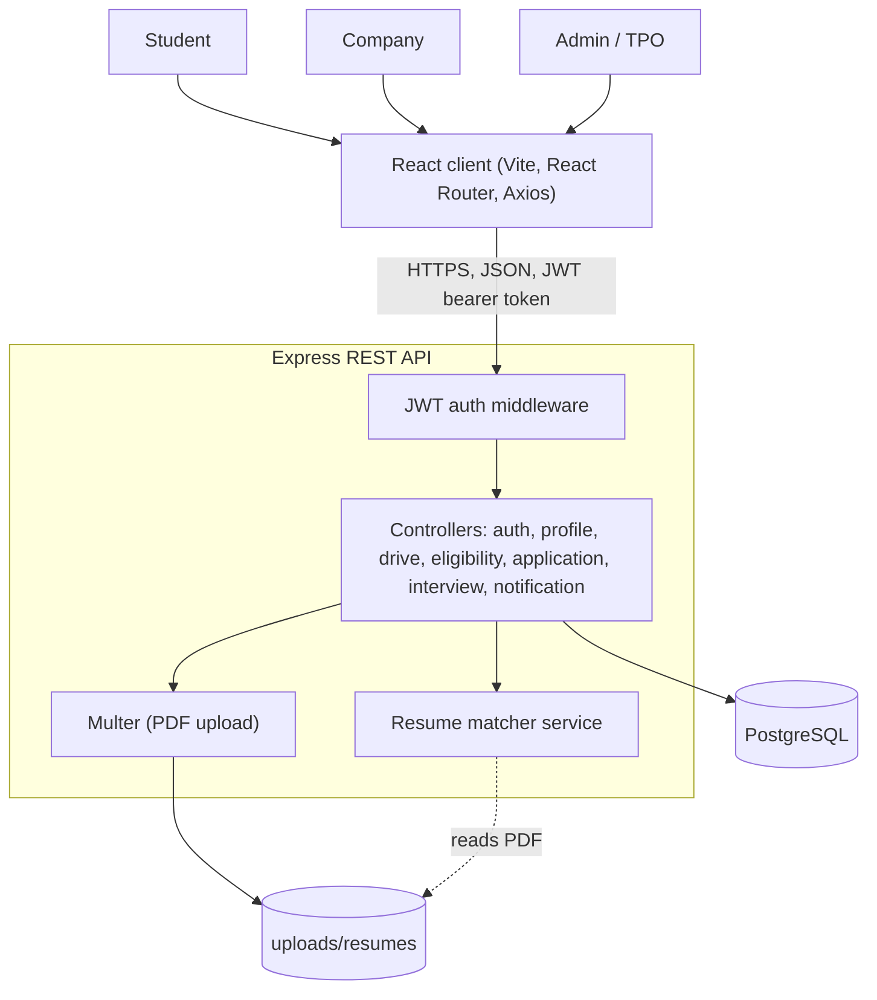

# DayZer0: Campus Placement Portal

A role-based web application that replaces scattered emails, spreadsheets and notice boards with one connected placement workflow. Students, recruiting companies and the Training & Placement Officer (TPO) work on the same relational data: drives, eligibility, applications, resume matching, interviews and notifications.


## Features

**Student**
- Register with academic details (branch, batch, CGPA, active backlogs) and manage a profile
- Upload, view and delete PDF resumes
- See approved drives with a live eligibility verdict and the specific reasons when not eligible
- Apply with a chosen resume, track status, withdraw before a decision
- See an AI resume match score with matched and missing keywords for each application
- Book interview slots once shortlisted, and receive in-app notifications with an unread count

**Company**
- Register and wait for TPO verification before posting
- Post drives with a job description, package, location, deadline and positions
- Set eligibility criteria per drive (minimum CGPA, maximum backlogs, eligible branches)
- Review applicants for its own drives with resume links and match scores, then shortlist, reject or select
- Schedule interview rounds with date, time, location and slot capacity

**Admin (TPO)**
- Verify or reject companies
- Review drives with company details and eligibility criteria visible, then approve or reject

## Tech stack

| Layer | Technology | Why |
|---|---|---|
| Frontend | React (Vite), React Router, Axios | Component reuse across three role-based UIs, fast dev builds |
| Backend | Node.js, Express | REST API in the same language as the client, minimal routing layer |
| Database | PostgreSQL (`pg`) | Strict relational integrity between tightly coupled entities |
| Auth | JWT, bcrypt | Stateless sessions, hashed passwords |
| Files | Multer | PDF-only uploads with a size limit |
| Resume parsing | `pdf-parse` | Text extraction from PDF resumes |

## Architecture



**Role-based access control is structural.** There is no shared `users` table. A person's role is the table their row lives in (`student`, `company` or `admin`). Login checks the matching table and issues a JWT carrying `{ id, role }`, and every protected route checks that role server-side.

## Database

Eleven normalized tables: `student`, `company`, `admin`, `placement_drive`, `eligibility_criteria`, `resume`, `application`, `ai_resume_matcher`, `interview_round`, `interview_booking`, `notification`.

Constraints that carry business rules:
- `UNIQUE(student_id, drive_id)` on `application` blocks duplicate applications
- `UNIQUE(round_id, student_id)` on `interview_booking` blocks duplicate bookings
- Foreign keys cascade where a child is meaningless without its parent, and a resume used by an application cannot be deleted
- Resume PDFs live on disk. The database stores only the stored file name and the original name

## Server-side rules

These are enforced by the API, not just hidden in the UI.

- Only verified companies can post drives, and students see only approved drives
- A drive deadline cannot be in the past, and applications close after the deadline
- Eligibility is recomputed on every request and re-validated when applying
- The resume used must belong to the applicant
- Only shortlisted students can book a round, and capacity is checked in the same `INSERT` that creates the booking
- `placement_status` is recomputed from application state, so a student is `placed` only while at least one application is `selected`

## Resume matching

Implemented in `backend/services/matcher.js` and run when a student applies.

1. Extract text from the PDF with `pdf-parse`
2. Tokenize, lowercase and drop stop words from the resume and from the job title plus description
3. Score = 60% job-description-weighted keyword coverage + 40% cosine similarity on term-frequency vectors
4. Store the score on the application and the matched and missing keywords as feedback

Matching failures never block an application. Scanned image-only PDFs have no text layer and score 0 with an explanatory message.

## Getting started

**Prerequisites:** Node.js 18+, PostgreSQL 14+.

```bash
git clone https://github.com/manya-ahuja20/DayZer0-campus-placement-portal.git
cd DayZer0-campus-placement-portal
```

**1. Database**
```bash
psql -U postgres -c "CREATE DATABASE dayzero;"
psql -U postgres -d dayzero -f backend/schema.sql
```

**2. Backend**
```bash
cd backend
npm install
cp .env.example .env     # on Windows: copy .env.example .env
# edit .env with your database password and a long random JWT_SECRET
npm run dev              # http://localhost:5000
```

**3. Frontend** (second terminal)
```bash
cd frontend
npm install
npm run dev              # http://localhost:5173
```

The API base URL is set in `frontend/src/api/axios.js`, and resume links use `http://localhost:5000`. Change both if you deploy elsewhere.

### First run

1. Register an **admin** and a **company** at `/register`
2. Log in as admin, open **Companies** and verify the company
3. Log in as the company, post a drive and set its eligibility criteria
4. As admin, open **Review drives** and approve it
5. Register a **student**, upload a PDF resume on the profile page, then apply from **Drives**
6. As the company, open **Applicants**, shortlist the student, then add a round under **Interviews**
7. As the student, book the slot and check **Notifications**

## API overview

All routes except register, login and resume download require `Authorization: Bearer <token>`.

| Area | Endpoints |
|---|---|
| Auth | `POST /api/auth/register`, `POST /api/auth/login` |
| Profile | `GET/PUT /api/profile`, `GET/POST /api/profile/resume`, `DELETE /api/profile/resume/:id`, `GET /api/profile/resume/:id/download` |
| Drives | `POST /api/drives`, `GET /api/drives/mine`, `GET /api/drives/all`, `GET /api/drives/approved`, `PUT /api/drives/:id`, `PATCH /api/drives/:id/review`, `GET /api/drives/companies`, `PATCH /api/drives/company/:id/verify` |
| Eligibility | `POST/GET /api/eligibility/:driveId`, `GET /api/eligibility/:driveId/check`, `GET /api/eligibility/student/drives` |
| Applications | `POST /api/applications/:driveId`, `GET /api/applications/mine`, `DELETE /api/applications/:id`, `GET /api/applications/drive/:driveId`, `PATCH /api/applications/:id/status` |
| Interviews | `POST/GET /api/interviews/drive/:driveId`, `GET /api/interviews/mine`, `DELETE /api/interviews/:roundId`, `POST/DELETE /api/interviews/:roundId/book` |
| Notifications | `GET /api/notifications`, `PATCH /api/notifications/read-all`, `PATCH /api/notifications/:id/read` |

## Project structure

```
backend/
  config/          db.js, multer.js
  middleware/      auth.js (JWT verification)
  controllers/     auth, profile, drive, eligibility, application, interview, notification
  routes/          one router per controller
  services/        matcher.js (resume matching), notify.js
  schema.sql
  server.js
frontend/src/
  api/             axios.js (instance with JWT interceptor)
  context/         AuthContext.jsx
  components/      Layout.jsx
  pages/           Login, Register, Profile, student / company / admin pages
```

## Known limitations

- The resume download endpoint is unauthenticated so links open in a new tab. Production would use signed, expiring URLs
- The JWT is stored in `localStorage` and there are no refresh tokens
- Company verification is a manual TPO action with no automated checks
- Notifications are in-app only, and only students receive them
- Matching is keyword-based, with no synonym handling and no structured extraction of skills, education or experience
- There are no automated tests yet

## Roadmap

- Skill taxonomy with aliases, and evidence-weighted scoring by resume section
- Must-have versus nice-to-have parsing of job descriptions, with per-requirement evidence in the feedback
- An evaluation harness comparing matcher versions on labeled resume and job description pairs
- Email notifications, and role-based route guards on the client

## Author

Manya Ahuja
